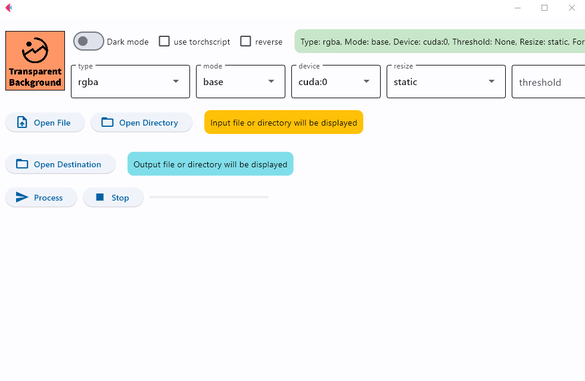

<div align="center">

# VideoBGRemover Portable

**Портативная сборка для удаления фона с видео под Windows. Установка в один клик, работа офлайн.**

[](https://github.com/vlad-ir/VideoBGRemover-Portable/stargazers)
[](LICENSE)
[](https://github.com/vlad-ir/VideoBGRemover-Portable/commits)
[](https://github.com/vlad-ir/VideoBGRemover-Portable/releases)



</div>

VideoBGRemover — графическое приложение на основе [InSPyReNet (ACCV 2022)](https://github.com/plemeri/InSPyReNet.git) и решения автора [plemeri](https://github.com/plemeri/transparent-background) для автоматического удаления фона с видео с помощью нейросети. Поддерживает замену фона на зелёный экран (green screen) или генерацию альфа-маски (mask) для дальнейшей обработки.

## Возможности

- Автоматическое удаление фона с видео на основе нейросети
- Режим **Green Screen** — замена фона на зелёный цвет
- Режим **Mask** — генерация чёрно-белой маски переднего плана
- Поддержка **GPU** (NVIDIA CUDA) и **CPU**
- Работа с файлами, содержащими **русские буквы** в именах
- Портативность — все файлы в одной папке, ничего не устанавливается в систему
- Сохранение результата в исходном разрешении
- Тёмная тема интерфейса

## Системные требования

- Windows 10/11 (64-bit)
- NVIDIA GPU с поддержкой CUDA (рекомендуется для скорости обработки видео)
- Или CPU (медленнее, но работает)
- 4GB+ RAM
- 5GB свободного места на диске (включая модели ~1-2GB)

### Рекомендуемые видеокарты

| Серия | CUDA версия | Рекомендуется |
|-------|-------------|---------------|
| GTX 10xx (Pascal) | CUDA 11.8 | Да |
| RTX 20xx (Turing) | CUDA 11.8 | Да |
| RTX 30xx (Ampere) | CUDA 12.1 | Да |
| RTX 40xx (Ada Lovelace) | CUDA 12.1 | Да |
| RTX 50xx (Blackwell) | CUDA 12.1 | Да |

> **Примечание:** В комплекте устанавливается PyTorch с поддержкой CUDA 12.8, который корректно работает на системах с CUDA 12.1–12.8.

## Установка

### Быстрая установка (рекомендуется)

1. Скачайте архив `VideoBGRemover_Portable.zip` из [релизов](https://github.com/vlad-ir/VideoBGRemover-Portable/releases)
2. Распакуйте в любую папку в корне диска. Название папки латиницей, без пробелов (например `D:\VideoBGRemover`)
3. Запустите `VideoBGRemover.bat`
4. Выберите пункт **4. Install / Re-install Transparent Background**
5. Дождитесь завершения установки (скачивается Miniconda, PyTorch, модели)

### Установка из исходников

1. Клонируйте репозиторий: `git clone https://github.com/vlad-ir/VideoBGRemover-Portable.git`
2. Запустите `VideoBGRemover.bat`
3. Выберите пункт **4. Install / Re-install Transparent Background**
4. Дождитесь завершения установки

Установщик автоматически скачает и настроит:
- Miniconda (портативный Python 3.10)
- PyTorch с поддержкой CUDA 12.8
- UV package manager (ускоренная установка зависимостей)
- Пакет `transparent-background[gui]` с нейросетевой моделью
- Все необходимые Python-библиотеки

## Запуск

1. Запустите `VideoBGRemover.bat`
2. Выберите пункт **1. Start GUI** — откроется графический интерфейс
3. Или выберите пункт **2. Process video: Green screen** или **3. Process video: Mask** для обработки через консоль

## Использование

### Через графический интерфейс (GUI)

1. Выберите пункт **1. Start GUI** в меню
2. В открывшемся окне нажмите **Upload** и выберите видеофайл
3. Выберите режим:
   - **Green Screen** — фон заменится на зелёный цвет
   - **Mask** — сгенерируется чёрно-белая маска
4. Нажмите **Run** и дождитесь обработки
5. Результат сохранится автоматически

### Через консоль (drag & drop)

1. Выберите пункт **2. Process video: Green screen** или **3. Process video: Mask**
2. Перетащите видеофайл в окно консоли и нажмите Enter
3. Обработка начнётся автоматически
4. Результат сохранится в папку `outputs/`

### Описание пунктов меню

| Пункт | Назначение |
|-------|------------|
| **1. Start GUI** | Запуск графического интерфейса |
| **2. Process video: Green screen** | Обработка видео с заменой фона на зелёный |
| **3. Process video: Mask** | Обработка видео с генерацией маски |
| **4. Install / Re-install** | Первая установка или переустановка |
| **5. Update** | Обновление всех компонентов |

## Работа без GUI (из скрипта)

Вы можете использовать пакет `transparent-background` напрямую в командной строке:

### Green screen
```bash
transparent-background --source video.mp4 --dest outputs/ --type green --mode base
```
### Mask
```bash
transparent-background --source video.mp4 --dest outputs/ --type map --mode base
```
## Структура папок
```
VideoBGRemover-Portable/
├── VideoBGRemover.bat     # Главный файл запуска
├── tools/                 # Портативные инструменты
│   ├── miniconda/         # Python окружение
│   └── uv.exe             # UV package manager
├── .venv/                 # Виртуальное окружение Python
├── models/                # Нейросетевые модели
├── outputs/               # Сохранённые результаты
└── cache/                 # Кэш пакетов
```
## Изоляция

Приложение полностью изолировано и не создаёт файлы за пределами своей папки:
- Все модели в `models/`
- Все кэши в `cache/`
- Результаты в `outputs/`
- Системные переменные окружения не изменяются

## Решение проблем

### Ошибка "transparent-background not found"
- Убедитесь, что установка завершена успешно
- Запустите установку повторно: `VideoBGRemover.bat` → **4. Install / Re-install**

### Ошибка "CUDA out of memory"
- Закройте другие приложения, использующие GPU
- Уменьшите разрешение исходного видео
- Перезапустите приложение

### Медленная обработка на CPU
- Обработка видео на CPU занимает значительно больше времени
- Рекомендуется использовать NVIDIA GPU

### Модель загружается медленно
- При первом запуске модель скачивается (~1-2GB)
- Последующие запуски будут быстрее (модель кэшируется)

### Ошибка при обработке
- Убедитесь, что видеофайл не повреждён
- Попробуйте конвертировать видео в MP4 (H.264) перед обработкой

## Лицензия

Данный проект распространяется под лицензией MIT.

## Авторы
- **plemeri** ([github.com/plemeri](https://github.com/plemeri/transparent-background)) — автор оригинального решения
- **NeiroVlad** ([github.com/vlad-ir](https://github.com/vlad-ir)) — автор портабельной сборки
- **oti.by** ([t.me/vlad_vlk](https://t.me/vlad_vlk)) — [oti.by](https://oti.by) — нейронные сети и умные чат-боты для бизнеса
- **Нейронки в бизнесе и в жизни** ([t.me/neiro_com](https://t.me/neiro_com)) — промпты, примеры, советы и т.д.

## Поддержать автора

Если проект оказался полезным, поставьте ⭐ на GitHub!

**Карта UnionPay:** `6229644000154242`

---

<div align="center">

**[⬆ Наверх](#videobgremover-portable)**

</div>
